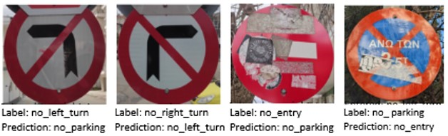

# GRATS

This repository contains the dataset that proposed in the paper  "Traffic Signs Recognition Robustness in Autonomous Vehicles under Physical Adversarial Attacks" which published as a book chapter in "Future Intelligent Transport Systems: Current and Future Perspective Book Series: “AAP Advances in Artificial Intelligence and Robotics”.

# Structure of Dataset

 * Dataset
   * clear_road_signs
     * train
     * test
   * dirty_road_signs
     * train
     * test
